# Verdaca — Architecture & Strategy Diagrams

**Last refreshed:** 2026-05-13 | **HEAD at refresh:** `e7c6f1d`

> **Verdaca is not an agent framework.** Agent frameworks are the substrate Verdaca runs on top of. Verdaca is **deliberation infrastructure** for organizations that need to make repeatable, auditable, compounding decisions. The closest analogue is *not* ChatGPT or LangChain — it's a structured strategy engagement with a consulting firm, except the engagement compounds and costs $2.50 instead of $250,000.

## Audience Router — start here

| You are… | Read in this order |
|---|---|
| 👔 **CTO / strategic buyer** | §1 Why This Matters → Diagram 2 (Buyer's Journey) → Diagram 4 (Trust Stack) |
| 💼 **Investor / strategic skeptic** | §1 Why This Matters → Diagram 1 (Category Map) → Diagram 3 (Signal vs Proxy) |
| 🛠️ **Engineer evaluating to build** | §2 How It's Built → Diagram 6 (Top-level arch) → Diagram 10 (Memory dual-adapter) |
| 🤝 **AI engineer being recruited** | §1 first to engage, §2 second to convince. Pay attention to Diagram 5 (Contract-Test Gate) |
| 📋 **Engineer tracking build progress** | §2 How It's Built → Diagram 7 (Stage 9 sequence) — colors track status |

---

## Legend

| Color | Status | Meaning |
|---|---|---|
| 🟢 Green | `done` | Ratified, shipped, tests green |
| 🟡 Amber | `inflight` | Currently being built |
| ⚪ Gray dashed | `planned` | On roadmap, not started |
| 🔵 Blue | `deferred` | Authorized but parked (not blocking sequence) |

To update progress: find the node in the mermaid block and change the `:::status` suffix.

---

# §1 Why This Matters

*The bet, the moat, the buyer's perspective. Read these five before the architecture.*

---

## Diagram 1 — Category Map: The Empty Quadrant

**Question this answers:** "Is Verdaca just another agent framework?"

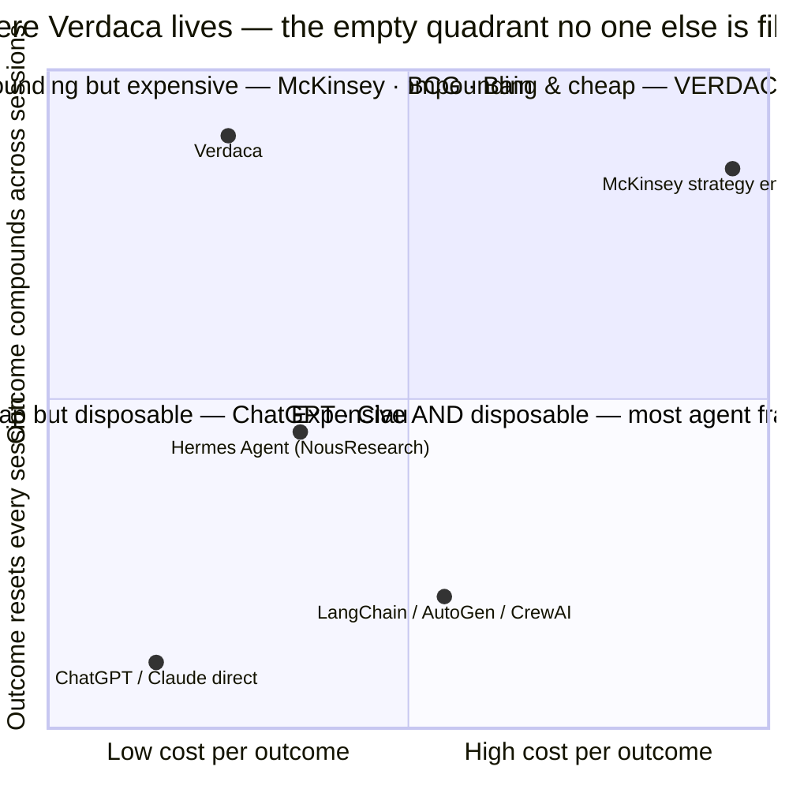

**Caption:** *The empty quadrant is the bet. The question is no longer "why Verdaca?" — it's "why isn't anyone else here yet?" The answer is in Diagram 3.*

---

## Diagram 2 — Buyer's Journey: What $2.50 and 12 Minutes Buys

**Question this answers:** "What do I actually get?"

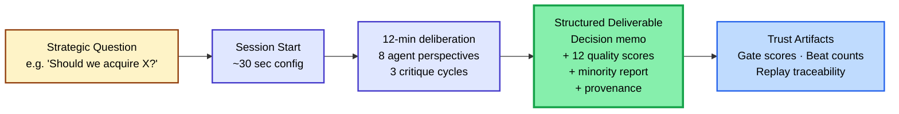

**Caption:** *Most AI products end at "Structured Deliverable." Verdaca delivers the trust artifacts too — every decision is replayable, every score auditable, every dissent captured. That's the difference between an answer you take to a meeting and an answer you take to a board.*

---

## Diagram 3 — Signal vs Proxy: The Moat Competitors Can't Replicate

**Question this answers:** "Why can't a competitor just copy this?"

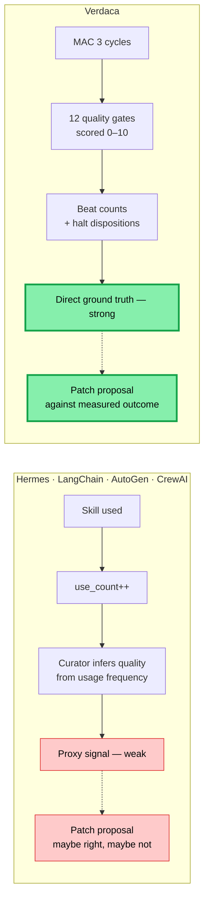

**Caption:** *Both produce skill patches. Only one knows whether the skill actually worked. To replicate Verdaca, a competitor must first build the MAC quality-gate methodology — but they're optimizing for individual-developer breadth, not enterprise deliberation depth. They're not going to.*

---

## Diagram 4 — Trust Stack: Why Outputs Are Defensible

**Question this answers:** "If I take this memo to my board, can I defend it?"

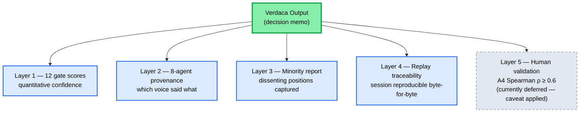

**Caption:** *Layer 5 is dashed because A4 human validation is deferred to Stage 7 debt clearance — every Verdaca metric citation today carries the caveat "(internal scoring; A4 deferred)" verbatim. Honesty here is the sales lever. Buyers trust roadmaps they can verify.*

---

## Diagram 5 — Contract-Test Gate: The Substitutability Proof

**Question this answers:** "How do you avoid provider lock-in structurally, not aspirationally?"

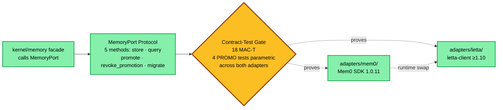

**Caption:** *Swapping Mem0 for Letta is a config change. The 18 contract tests are the only thing that authorizes the swap. Hermes Agent, LangChain, AutoGen — none enforce this at the type-system layer. This is what "ports-and-adapters" actually buys: provider lock-in resistance proven by CI.*

---

# §2 How It's Built

*Engineering progress tracker — port wiring, adapter status, supply-chain CI. Status colors track build state.*

---

## Diagram 6 — Top-Level Architecture (everything in one view)

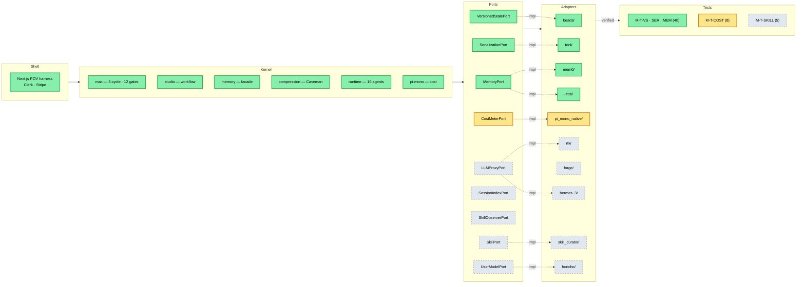

---

## Diagram 7 — Stage 9 Sequence (Sub-Stage Progress)

```mermaid
flowchart LR
    S91["9.1<br/>Base"]:::done
    S92["9.2<br/>Ports arch v0.2"]:::done
    S93["9.3<br/>Test strategy v0.2"]:::done
    S941["9.4.1<br/>Beads"]:::done
    S942["9.4.2<br/>TONL"]:::deferred
    S943["9.4.3<br/>Memory dual"]:::done
    S944["9.4.4<br/>Pi-Mono A.2"]:::inflight
    S945["9.4.5<br/>RTK + LLMProxy"]:::planned
    S946["9.4.6<br/>Forge"]:::planned
    S947["9.4.7<br/>Atomic PR"]:::planned
    S948["9.4.8<br/>Upstream + FTS5"]:::planned
    S95["9.5<br/>Arch review"]:::planned
    S96["9.6<br/>Cleo supply-chain"]:::planned
    S99["9.9<br/>Test ratification"]:::planned

    S91 --> S92 --> S93 --> S941
    S941 --> S942
    S941 --> S943
    S943 --> S944
    S944 --> S945 --> S946 --> S947 --> S948 --> S95 --> S96 --> S99

    classDef done fill:#86efac,stroke:#16a34a,stroke-width:2px,color:#000
    classDef inflight fill:#fde68a,stroke:#d97706,stroke-width:2px,color:#000
    classDef planned fill:#e2e8f0,stroke:#64748b,stroke-width:1px,color:#000,stroke-dasharray: 5 5
    classDef deferred fill:#bfdbfe,stroke:#2563eb,stroke-width:2px,color:#000
```

**Estimate:** ~12–17 sessions remaining in Stage 9.

---

## Diagram 8 — Stage 10 Self-Learning Pipeline (4-Phase Roadmap)

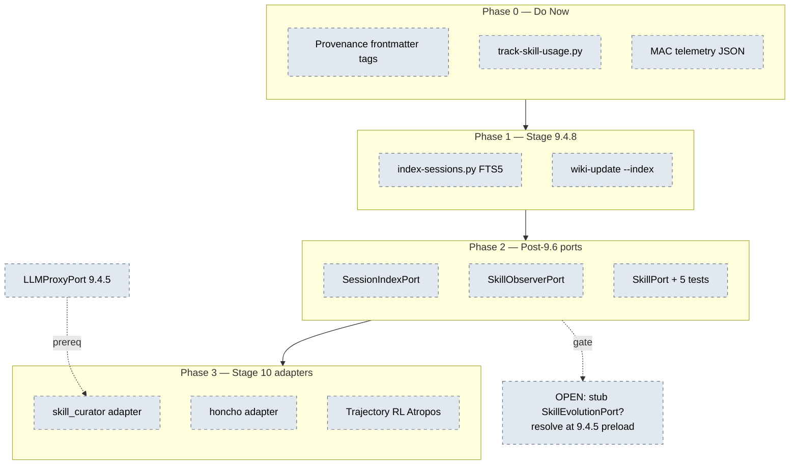

---

## Diagram 9 — MAC Outcome-Signal Flow (engineering view)

Engineering-internal view of the same moat shown in §1 Diagram 3 — but here the focus is on the signal pipeline (where data flows today vs Stage 10) rather than the competitive contrast.

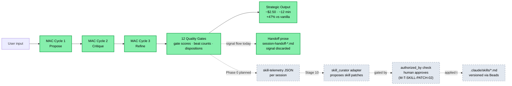

---

## Diagram 10 — Memory Port: Dual-Adapter Reference Pattern

Engineering-internal worked example of the substitutability shown in §1 Diagram 5. Reference pattern for how new ports get their adapters (curator, Honcho at Stage 10).

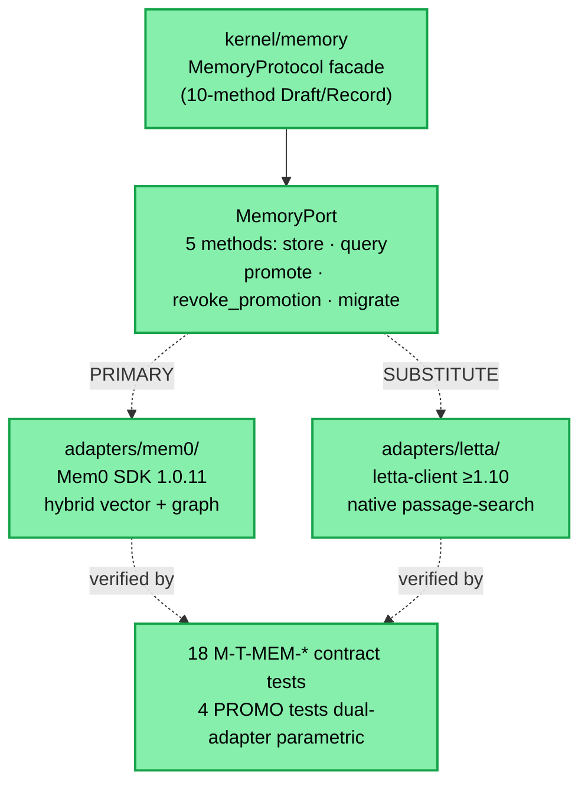

---

## Diagram 11 — Stage 9.6 Cleo Supply-Chain (Dependency Automation)

What lands when 9.6 ratifies. Documents the future CI/CD pipeline for keeping provider versions current.

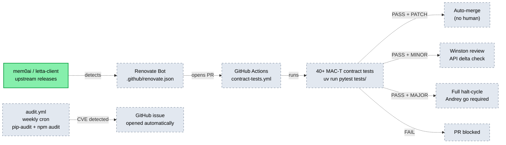

---

## Status Update Workflow

When a node changes state, edit the `:::status` suffix in the relevant mermaid block and update the "Last refreshed" line at the top. Status transitions:

- `planned` → `inflight` — when an executor opens a chat for that work
- `inflight` → `done` — when the close-handoff merges to main and CI is green
- `planned` → `deferred` — when team-lead authorizes deferred-work parallel launch (not blocking sequence)

Optionally commit the diagram update alongside the work — diagrams become part of the close-handoff §provenance trail.
