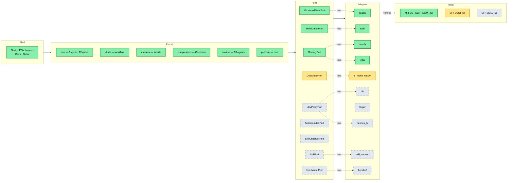
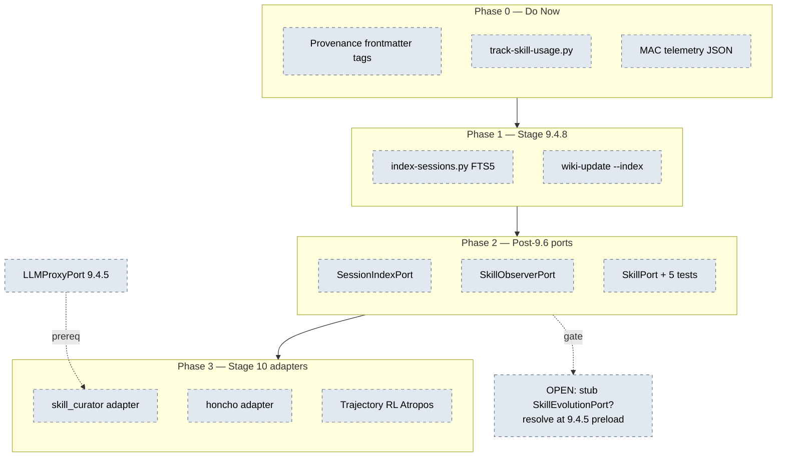
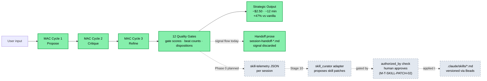
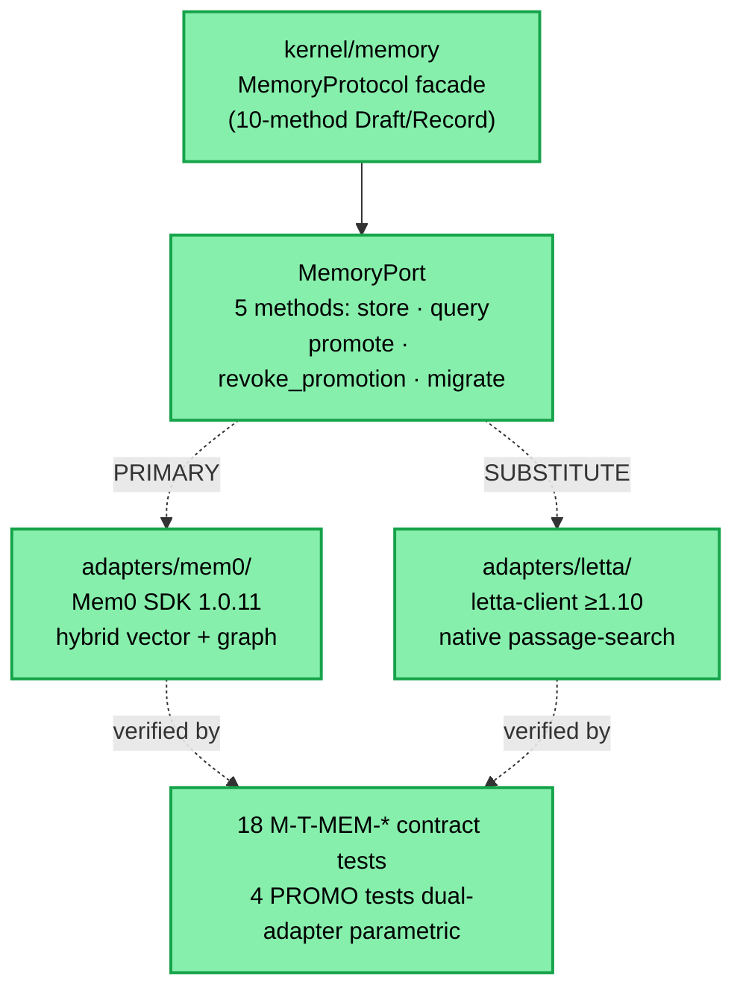
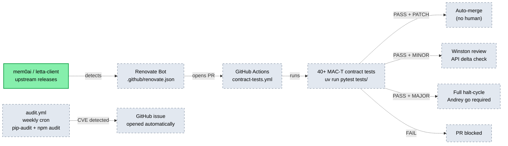

# Verdaca — Architecture Diagrams

**Purpose:** Visual progress tracker for the Verdaca build. Update the status class on a node when it moves between states. Renders in GitHub, GitLab, VS Code preview, Obsidian, and most markdown viewers with mermaid support.

**Last refreshed:** 2026-05-13 | **HEAD at refresh:** `97ceb6d`

---

## Legend

| Color | Status | Meaning |
|---|---|---|
| 🟢 Green | `done` | Ratified, shipped, tests green |
| 🟡 Amber | `inflight` | Currently being built |
| ⚪ Gray dashed | `planned` | On roadmap, not started |
| 🔵 Blue | `deferred` | Authorized but parked (not blocking sequence) |

To update progress: find the node in the mermaid block and change the `:::status` suffix.

---

## 1. Top-Level Architecture (everything in one view)

---

## 2. Stage 9 Sequence — Sub-Stage Progress

```mermaid
flowchart LR
    S91["9.1<br/>Base"]:::done
    S92["9.2<br/>Ports arch v0.2"]:::done
    S93["9.3<br/>Test strategy v0.2"]:::done
    S941["9.4.1<br/>Beads"]:::done
    S942["9.4.2<br/>TONL"]:::deferred
    S943["9.4.3<br/>Memory dual"]:::done
    S944["9.4.4<br/>Pi-Mono A.2"]:::inflight
    S945["9.4.5<br/>RTK + LLMProxy"]:::planned
    S946["9.4.6<br/>Forge"]:::planned
    S947["9.4.7<br/>Atomic PR"]:::planned
    S948["9.4.8<br/>Upstream + FTS5"]:::planned
    S95["9.5<br/>Arch review"]:::planned
    S96["9.6<br/>Cleo supply-chain"]:::planned
    S99["9.9<br/>Test ratification"]:::planned

    S91 --> S92 --> S93 --> S941
    S941 --> S942
    S941 --> S943
    S943 --> S944
    S944 --> S945 --> S946 --> S947 --> S948 --> S95 --> S96 --> S99

    classDef done fill:#86efac,stroke:#16a34a,stroke-width:2px,color:#000
    classDef inflight fill:#fde68a,stroke:#d97706,stroke-width:2px,color:#000
    classDef planned fill:#e2e8f0,stroke:#64748b,stroke-width:1px,color:#000,stroke-dasharray: 5 5
    classDef deferred fill:#bfdbfe,stroke:#2563eb,stroke-width:2px,color:#000
```

**Estimate:** ~12–17 sessions remaining in Stage 9.

---

## 3. Stage 10 Self-Learning Pipeline (4-Phase Roadmap)

---

## 4. MAC Outcome-Signal Flow (the moat, today vs planned)

This diagram shows Verdaca's structural advantage over competitor agent frameworks: MAC produces **direct quality signals** that today flow to handoff prose and get discarded. Stage 10 captures them and feeds a curator.

---

## 5. Memory Port — Adapter Strategy (worked example of dual-adapter pattern)

Reference pattern for how new ports get adapters. Useful for understanding how Stage 10 curator + Honcho adapters will land.

---

## 6. Stage 9.6 Cleo Supply-Chain — Dependency Automation

What lands when 9.6 ratifies. Documents the future CI/CD pipeline for keeping provider versions current.

---

## Status Update Workflow

When a node changes state, edit the `:::status` suffix in the relevant mermaid block and update the "Last refreshed" line at the top. Status transitions:

- `planned` → `inflight` — when an executor opens a chat for that work
- `inflight` → `done` — when the close-handoff merges to main and CI is green
- `planned` → `deferred` — when team-lead authorizes deferred-work parallel launch (not blocking sequence)

Optionally commit the diagram update alongside the work — diagrams become part of the close-handoff §provenance trail.
