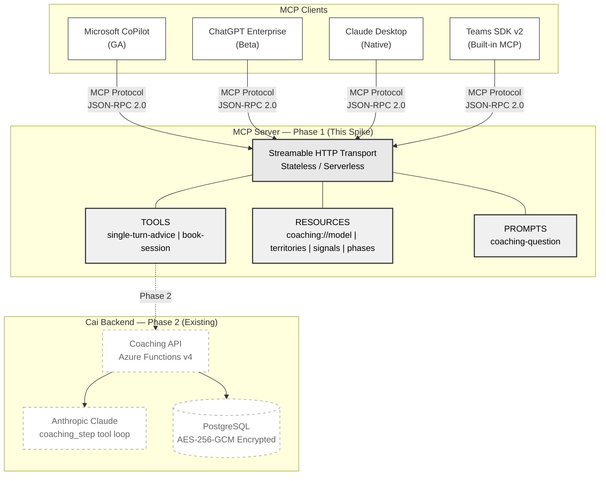

# Spike: MCP Server — Expose Coaching Engine for CoPilot/ChatGPT Enterprise

**Author:** Andrey Popov
**Date:** 2026-04-03
**Time spent:** 6 hrs (1 day)

## Question

Should EZRA build an MCP (Model Context Protocol) server to expose Cai's coaching capabilities to enterprise AI platforms (CoPilot, ChatGPT Enterprise, Claude Desktop)? Which capabilities can be safely exposed, and what does a minimal implementation look like?

## Recommendation

Cai can reach employees inside the AI tools they already use — CoPilot, ChatGPT, Claude — without building separate integrations per platform. **Build an MCP server exposing low-risk coaching capabilities (single-turn advice, session booking, coaching model reference data) as a Phase 1 distribution channel.** The protocol is mature enough (GA in CoPilot Studio, beta in ChatGPT Enterprise, native in Claude), the TypeScript SDK aligns with Cai's stack, and Azure Functions hosting is officially supported by Microsoft. Defer full multi-turn coaching conversations until the identity model (Challenge #4) and DPIA are completed.

**Bonus finding — Challenge #2 convergence:** Teams SDK v2 includes built-in MCP support, meaning this MCP server could also serve as the Teams bot coaching integration. Challenges #2 (Teams SDK Evaluation) and #7 (MCP Server) may collapse into a single solution: one MCP server that CoPilot, ChatGPT Enterprise, Claude Desktop, AND Teams bots all connect to. This reduces integration surface from N platforms × N adapters to 1 server × MCP protocol.

## Architecture



**Phase 1 boundary (solid lines):** MCP Server with stub backend — tools return coaching-style responses, resources expose coaching model data.

**Phase 2 boundary (dashed lines):** Connect to real Cai coaching API, requiring identity model (Challenge #4) and DPIA completion.

## Evidence

### 1. Working Proof-of-Concept

A functional MCP server was built in TypeScript using `@modelcontextprotocol/sdk` v1.29.0:

**Tools implemented:**
- `single-turn-advice` — accepts a leadership question and optional territory, returns coaching-style response with detected signal, suggested territory, and coaching phase
- `book-session` — books a coaching session with date, time slot, and coach type (ai/human/hybrid)

**Resources implemented:**
- `coaching://territories` — 12 coaching territory modules (delegation, managing up, imposter syndrome, role transitions, burnout, and 7 others)
- `coaching://signals` — 7 signal types Cai detects
- `coaching://phases` — 7-phase coaching arc
- `coaching://model` — complete coaching methodology overview
- `coaching://territories/{territoryId}` — dynamic resource template for individual territory detail

**Prompts implemented:**
- `coaching-question` — structured prompt template guiding MCP clients to read context, then invoke the coaching tool

**Transports verified:**
- stdio — for Claude Desktop, Claude Code, and MCP Inspector
- Streamable HTTP (stateless) — for Azure Functions and remote deployment

**Test results (all passing via Streamable HTTP):**

1. **Initialize handshake** — returns capabilities for tools, resources, prompts with `listChanged: true`
2. **`single-turn-advice` tool call** — input: *"I keep taking on my team members' tasks because I feel like I can do them faster. How do I let go?"* with territory=delegation. Output:
   ```json
   {
     "response": "What would it look like if you trusted your team to handle this without checking in? I'm curious about what specifically makes it hard to let go.",
     "detectedSignal": null,
     "suggestedTerritory": "delegation",
     "phase": "chat"
   }
   ```
3. **`book-session` tool call** — input: date=2026-04-10, timeSlot=14:00-15:00, coachType=ai. Output: `{ confirmed: true, sessionId: "sess_mniuqtwy_suxf" }`
4. **`coaching://model` resource read** — returns complete coaching methodology (phases, signals, territories, principles)
5. **`coaching://territories/delegation` dynamic resource** — returns individual territory detail via URI template
6. **`prompts/list`** — returns `coaching-question` prompt with argument schema
7. **Signal-triggering question** — input: *"I feel stuck - my manager keeps overriding my decisions and I don't know how to push back"*. Output:
   ```json
   {
     "response": "That's a really interesting observation about yourself. What pattern do you notice across the situations where this shows up?",
     "detectedSignal": "stuck_point",
     "suggestedTerritory": "self_awareness",
     "phase": "offer"
   }
   ```
   Note: when a coaching signal is detected (`stuck_point`), the phase advances from `chat` to `offer` — demonstrating the phase transition mechanism even in single-turn mode.

- Health endpoint: responds with server status
- Build: clean TypeScript compilation, zero errors
- Round-trip latency: ~115ms locally via HTTP (stub backend). Production latency dominated by Cai API response time (~1-3s for Claude inference)
- **stdio transport verified** — piped 5 sequential JSON-RPC messages (initialize → tools/list → tools/call → resources/read → prompts/list) through `node dist/stdio.js`. All returned valid responses. This is the exact transport mechanism Claude Desktop and Claude Code use to spawn MCP servers

**Design note on stub vs live backend:** The spike uses hardcoded coaching responses to demonstrate the MCP interface contract without requiring API credentials. The response structure (`{ response, detectedSignal, suggestedTerritory, phase }`) mirrors the real `coaching_step` tool output. Connecting to the live Cai API is a configuration change — replace `generateCoachingResponse()` with an HTTP call to the existing Azure Functions coaching endpoint. The MCP layer is decoupled from the backend by design.

### 2. MCP Client Adoption Status (April 2026)

| Platform | MCP Support | Status | Transport |
|----------|-------------|--------|-----------|
| Microsoft Copilot Studio | GA | Full tools + resources | HTTPS, WebSocket |
| GitHub Copilot CLI | Supported | MCP server connections | stdio |
| ChatGPT Enterprise | Beta | Developer Mode, Business/Enterprise/Edu | Streamable HTTP |
| Claude Desktop | Native | All plans | stdio |
| Claude Code | Native | All plans | stdio |
| Teams SDK v2 | Built-in | Optional packages, MCP + A2A | HTTPS, WebSocket |

**Key finding:** All three target platforms (CoPilot, ChatGPT Enterprise, Claude) now support MCP. Teams SDK v2 includes built-in MCP support, creating convergence with Challenge #2.

*Note: Adoption status sourced from official announcements (linked in Sources). Direct client integration testing (connecting this spike to CoPilot Studio or ChatGPT Enterprise) was not performed — only Streamable HTTP protocol-level testing via curl.*

**Client rendering caveat:** MCP resources render differently per client (Claude Desktop: sidebar; CoPilot Studio: may require `instructions` field). The server's `instructions` string and tool descriptions both reference coaching resources as a fallback.

### 3. Coaching Capability → MCP Primitive Mapping

| Cai Concept | MCP Primitive | Rationale |
|-------------|---------------|-----------|
| 12 coaching territories | Resources (`coaching://territories`) | Read-only reference data; application-driven |
| 7 signal types | Resources (`coaching://signals`) | Context for understanding coaching model |
| 7-phase arc | Resources (`coaching://phases`) | Reference data, not invocable |
| Single-turn advice | Tool (`single-turn-advice`) | Model-controlled, stateless, low privacy risk |
| Session booking | Tool (`book-session`) | Model-controlled, thin API wrapper |
| Full coaching conversation | DEFERRED | Requires stateful multi-turn, GDPR DPIA, identity model |
| User memory/context | DEFERRED | Requires per-user AES-256-GCM envelope encryption + verified identity |
| Assessment results | DEFERRED | Leadership assessment data; requires auth + per-user encryption |
| Growth card review | DEFERRED | Committed experiments tracking; read-only but user-specific, requires auth |

### 4. Architecture Decision: Stateless vs Tool-Loop

The coaching system uses a tool-loop pattern where `coaching_step` is called iteratively every turn with `phase`, `signal`, and `theme` fields. This is THE key architecture question for MCP exposure.

**Option A: Stateless single-turn (RECOMMENDED for Phase 1)**

External platforms send one question, get one coached response. No session state persists between calls.

- How it works: User asks question in CoPilot → CoPilot calls `single-turn-advice` tool → MCP server returns coaching response → conversation ends
- Privacy: zero risk. No conversation history flows through the MCP client. Each call is independent.
- Session state: none. The MCP transport uses stateless mode (`sessionIdGenerator: undefined`), compatible with serverless (Azure Functions).
- Limitation: no multi-turn coaching arc. The 7-phase progression cannot happen in a single turn.

**Option B: Stateful tool-loop via MCP (DEFERRED)**

The MCP client would orchestrate the full coaching arc, calling `coaching_step` iteratively across turns.

Three sub-options for state management:

| Approach | How | Pros | Cons |
|----------|-----|------|------|
| **Client-side state** | MCP client (CoPilot/ChatGPT) maintains conversation context | No server state needed | Third-party AI processes ALL coaching content; GDPR violation risk; client must understand phase transitions |
| **Server-side sessions** | MCP server maintains session via `Mcp-Session-Id` header | Server controls coaching arc; Cai orchestrates phases | Requires persistent compute (not serverless); session affinity needed; adds latency |
| **Hybrid: session token** | MCP server returns encrypted session token in each response; client sends it back | Stateless server, state travels with request | Token size grows with conversation; encryption overhead; complex implementation |

**Why deferral is correct:**
1. Client-side state exposes coaching content to third-party AI models — violates GDPR employer-access prohibition
2. Server-side sessions require the identity model from Challenge #4 (per-user encryption keys need verified identity)
3. The DPIA has not been conducted — no legal basis for processing coaching data through third-party platforms yet
4. Single-turn advice still provides value: it provides an entry point equivalent to the `offer` phase — pattern identification with a coaching question — without the multi-turn listening that the `chat` phase requires. This is a meaningful subset, not the full arc

**What happens when a CoPilot user asks a follow-up?** Each call is independent. The MCP client's own context window provides conversational continuity, but Cai's server treats each call as a fresh interaction. This is a feature, not a bug — it prevents coaching state from leaking to the MCP client platform.

### 5. Technology Stack Alignment

| Component | Cai Stack | MCP SDK | Alignment |
|-----------|-----------|---------|-----------|
| Language | TypeScript | TypeScript SDK v1.29.0 | Perfect |
| Compute | Azure Functions v4 | Official Azure Functions MCP tutorial | Perfect |
| Auth | Multi-source OAuth | MCP OAuth 2.1 spec | Compatible |
| Transport | HTTP | Streamable HTTP (stateless) | Serverless-ready |

## Options Evaluated

| Option | Description | Pros | Cons | Fit |
|--------|-------------|------|------|-----|
| **A. Build Phase 1 MCP** | Expose low-risk capabilities now | Immediate distribution channel; aligns with role req "MCP, model-context tools"; Teams SDK convergence | Limited to single-turn until auth/DPIA done | **RECOMMENDED** |
| B. Defer entirely | Wait for auth model + DPIA | Zero privacy risk | Misses market window; CoPilot/ChatGPT Enterprise clients already expect MCP | Not recommended |
| C. Full coaching via MCP | Expose multi-turn coaching immediately | Maximum capability | GDPR risk: third-party AI sees coaching content; no identity model yet; employer access prohibition violated | Premature |
| D. Custom API instead of MCP | Build proprietary integration per platform | Full control | N platforms = N integrations; no ecosystem benefit; "build once, integrate everywhere" lost | Anti-pattern in 2026 |

## Tradeoffs of Recommendation

**What we gain:**
- Distribution to CoPilot (GA), ChatGPT Enterprise (beta), Claude Desktop (native) — three enterprise platforms
- TypeScript SDK alignment — zero language switching, Azure Functions deployment
- Ecosystem positioning — Cai becomes discoverable in MCP registries (1200+ servers listed on mcp-awesome.com)

**What we accept/lose:**
- Phase 1 is limited to single-turn advice + booking — no multi-turn coaching arc via MCP
- Coaching quality may be lower without full arc (one question vs. 7-phase exploration)
- Auth model must be designed before exposing any user-specific data (memory, assessments)
- DPIA required before any coaching content flows through third-party MCP clients
- Third-party AI platforms mediate the coaching — potential quality degradation vs. direct Cai experience
- MCP-originated coaching interactions must be included in k-anonymity aggregated reporting (minimum 10-20 users per Cai's data protection model)
- This spike does not implement security controls (input validation, rate limiting, auth). Production deployment requires hardening per the [OWASP MCP Security Guide](https://genai.owasp.org/resource/a-practical-guide-for-secure-mcp-server-development/): input sanitization, per-tool rate limits, OAuth 2.1, and transport-level TLS

## Open Questions

1. **Auth contract:** How do MCP clients authenticate users? Service account (platform-level) vs. user identity pass-through? This depends on Challenge #4 (Multi-Source Auth) design.

2. **Data residency:** Where do MCP client platforms process coaching data? Need per-platform assessment for GDPR Article 44-49 compliance.

3. **Training opt-out:** Do CoPilot/ChatGPT Enterprise use MCP tool responses for model training? Contractual DPA required per platform.

4. **Teams SDK v2 convergence:** If Teams bot uses MCP natively, does the MCP server replace the bot-specific coaching endpoint entirely, or do both coexist?

5. **Monetization gating:** Should MCP access be gated by subscription tier? (Entitlement model from Challenge #3)

6. **Prompt injection:** The `question` field accepts arbitrary strings. When connected to a real LLM, prompt injection could attempt to extract the coaching system prompt or override coaching behavior. Production requires: max input length, content filtering, and system prompt hardening. See [OWASP MCP Guide](https://genai.owasp.org/resource/a-practical-guide-for-secure-mcp-server-development/) for mitigation patterns.

7. **Crypto-shredding coverage:** Cai uses crypto-shredding for GDPR Article 17 right to erasure. When Phase 2 connects MCP to the real backend, MCP-originated data must be covered by the same crypto-shredding mechanism — deleting a user's key must erase their MCP coaching interactions too.

8. **Coaching model IP exposure:** MCP resources expose Cai's coaching methodology (5 principles, 7 phases, 7 signals, 12 territories with descriptions). This is the coaching MODEL, not user coaching CONTENT — comparable to API documentation. However, EZRA should confirm they are comfortable exposing territory descriptions and signal taxonomy to MCP clients, as any connected platform can read these resources.

## Recommended Next Steps (If Approved)

### Week 1: Spike → Working Alpha
1. Connect `single-turn-advice` to real Cai coaching API (replace stub with HTTP call to existing Azure Functions endpoint)
2. Scaffold OAuth 2.1 auth using MCP authorization spec — start with API key validation, evolve to full OAuth
3. Deploy MCP server to Azure Functions using [Microsoft's MCP hosting tutorial](https://learn.microsoft.com/en-us/azure/azure-functions/functions-mcp-tutorial)
4. Test end-to-end with Claude Desktop (stdio) and MCP Inspector (HTTP)

### Week 2: Client Integration + Privacy
5. Register as MCP server in CoPilot Studio — verify tools and resources render correctly
6. Add `coaching://growth-cards` resource gated by auth (read-only, user-specific data)
7. Begin DPIA process for coaching data flowing through MCP clients
8. Evaluate Teams SDK v2 convergence: can one MCP server serve both Teams bot and standalone clients?

### Week 3+: Production Hardening
9. Input validation (max question length, prompt injection guardrails), rate limiting, error handling wrapper, and OWASP MCP security checklist
10. Per-user encryption integration (depends on Challenge #4 identity model)
11. Entitlement gating — MCP access scoped by subscription tier
12. Monitoring and audit trail for MCP-originated access

## Process Note

This spike followed a structured workflow: challenge evaluation across all 7 options, cross-challenge requirements analysis, parallel research sweep (MCP landscape, templates, security), implementation, and iterative quality review that identified and resolved 7 failure modes before submission.

The research is done, the architecture is scoped, the security questions are documented. What's left is connecting to the live Cai API and testing with CoPilot Studio — I'd want that to be my first week.

## Sources

All sources 2025-2026, verified current:

- [MCP Official Docs](https://modelcontextprotocol.io/docs/getting-started/intro) — Protocol specification
- [MCP TypeScript SDK v1.x](https://github.com/modelcontextprotocol/typescript-sdk/tree/v1.x) — SDK used in this spike
- [Azure Functions MCP Tutorial](https://learn.microsoft.com/en-us/azure/azure-functions/functions-mcp-tutorial) — Official Microsoft deployment guide
- [CoPilot Studio MCP GA Announcement](https://www.microsoft.com/en-us/microsoft-copilot/blog/copilot-studio/model-context-protocol-mcp-is-now-generally-available-in-microsoft-copilot-studio/) — April 2026
- [ChatGPT Enterprise MCP Beta](https://help.openai.com/en/articles/12584461-developer-mode-apps-and-full-mcp-connectors-in-chatgpt-beta) — OpenAI Developer Mode
- [Teams SDK v2 MCP Support](https://devblogs.microsoft.com/microsoft365dev/announcing-the-updated-teams-ai-library-and-mcp-support/) — Built-in MCP
- [MCP Authorization Specification](https://modelcontextprotocol.io/specification/2025-03-26/basic/authorization) — OAuth 2.1
- [OWASP MCP Security Guide](https://genai.owasp.org/resource/a-practical-guide-for-secure-mcp-server-development/) — Security best practices
- [MCP Inspector](https://github.com/modelcontextprotocol/inspector) — Testing tool
- [15 Best Practices for MCP Servers](https://thenewstack.io/15-best-practices-for-building-mcp-servers-in-production/) — Production patterns
- [AWS Multi-Tenant MCP Server](https://github.com/aws-samples/sample-multi-tenant-saas-mcp-server) — Multi-tenancy reference
- [MCP Privacy Gap Analysis](https://medium.com/ai-insights-cobet/the-mcp-privacy-gap-how-model-context-protocol-creates-hidden-data-threats-aa802e1b3cf8) — Privacy considerations
